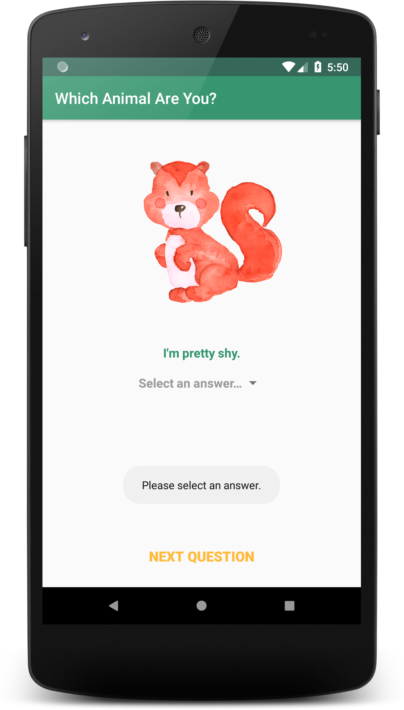
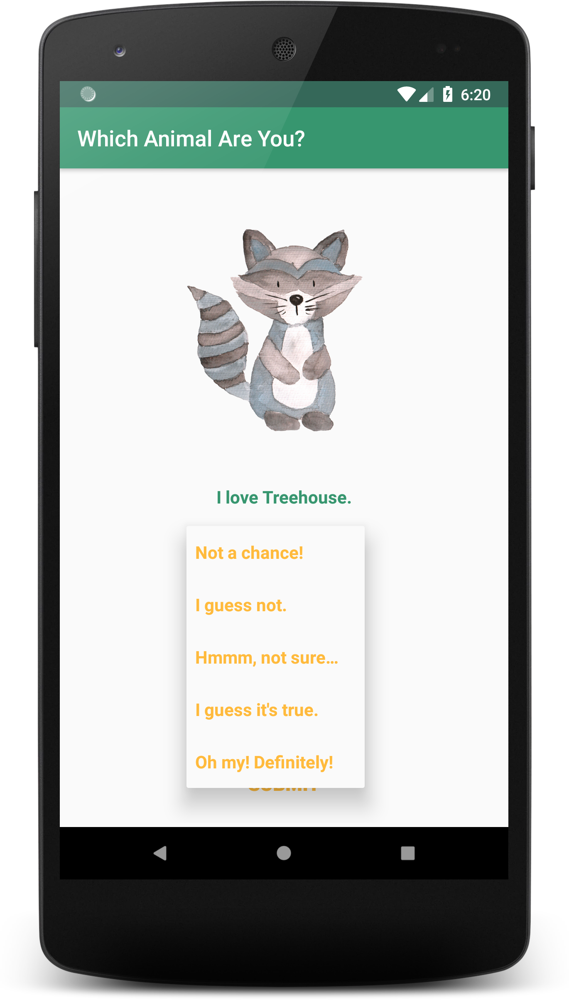
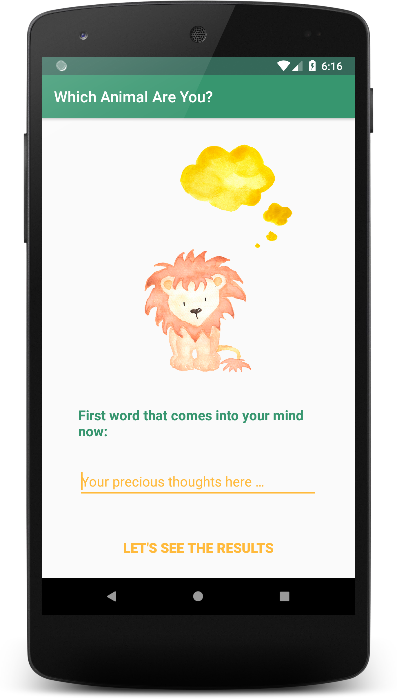

# Android Techdegree Treehouse Project 4: Which Animal Are You?

An interactive game for users to determine which kind of animals they are. The user will be presented with 10-12 statements. For each statement the user will be able to pick how much they agree or disagree with the statement (5 choices). When a user is satisfied with their choices they will click a ‘Submit’ Button at the bottom of the screen. When the ‘Submit’ Button is clicked, a new Activity will be launched and the animal which best represents the user will be displayed as the background of the Activity.

   

   

